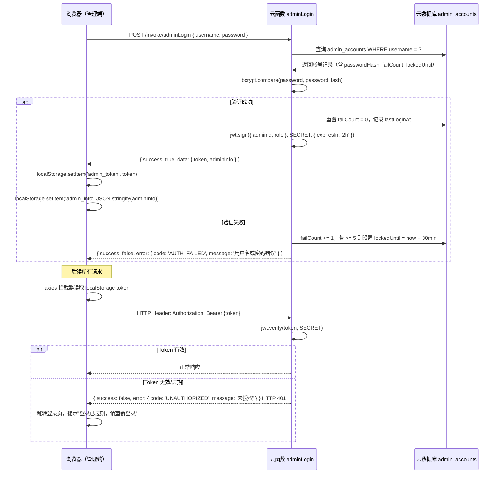

# 技术设计文档：cy-admin PC 管理系统

## 概述

本文档描述美甲美睫店铺 PC 管理系统（B 端）的技术架构与实现方案。系统为 React + TypeScript + Vite 构建的 Web 应用，通过 CloudBase HTTP API 调用云函数，与用户端微信小程序共享同一套 CloudBase 后端（云函数 + 云数据库）。

管理员通过浏览器访问，使用自定义 JWT Token 进行身份验证，覆盖账号管理、会员管理、技师排班、服务项目、预约订单、财务统计、提成核算、会员关系维护、会员卡折扣管理、数据安全等 11 个功能模块。

---

## 架构

### 系统架构图

```mermaid
graph TB
    subgraph "PC 浏览器（管理端）"
        A[React 页面层 Pages]
        B[Ant Design 组件层]
        C[React Query 数据层]
        D[Zustand 状态层]
        E[axios HTTP 客户端]
    end

    subgraph "认证层"
        F[JWT Token\nlocalStorage]
        G[axios 请求拦截器\n自动注入 Authorization]
    end

    subgraph "腾讯云 CloudBase cloud1-1g7yz5w766dd366f"
        H[CloudBase HTTP API\n/api/v2/envs/{envId}/functions/{name}/invoke]
        I[管理端专用云函数]
        J[共享云函数\n用户端已有]
        K[云数据库 MongoDB-like]
        L[云存储]
    end

    subgraph "共享数据库集合（用户端已有）"
        M[(members)]
        N[(services)]
        O[(technicians)]
        P[(appointments)]
        Q[(consumption_records)]
        R[(points_records)]
        S[(admins)]
    end

    subgraph "管理端新增数据库集合"
        T[(admin_accounts)]
        U[(member_cards)]
        V[(card_discount_levels)]
        W[(technician_service_slots)]
        X[(commission_records)]
        Y[(operation_logs)]
    end

    A --> B
    A --> C
    A --> D
    C --> E
    D --> E
    E --> G
    G --> F
    G --> H
    H --> I
    H --> J
    I --> K
    J --> K
    K --> M & N & O & P & Q & R & S
    K --> T & U & V & W & X & Y
    I --> L
```

### 技术栈

| 层次 | 技术选型 | 说明 |
|------|---------|------|
| 前端框架 | React 18 + TypeScript + Vite | PC Web 应用 |
| UI 组件库 | Ant Design 5.x | 表格、表单、图表等 |
| 状态管理 | Zustand | 全局状态（用户信息、权限） |
| 数据请求 | React Query + axios | 服务端状态缓存与同步 |
| 图表 | Ant Design Charts（@ant-design/charts） | 收入趋势图、分布图 |
| 路由 | React Router v6 | 页面路由与权限守卫 |
| 测试 | Vitest + fast-check | 单元测试 + 属性测试 |
| 后端 | CloudBase 云函数（Nodejs18，CommonJS） | 共享后端 |
| 数据库 | CloudBase 云数据库（MongoDB-like） | 共享数据库 |

---

## 组件与接口

### 前端页面结构

```
src/
├── main.tsx                        # 应用入口
├── App.tsx                         # 路由配置 + 权限守卫
├── pages/
│   ├── login/
│   │   └── LoginPage.tsx           # 登录页
│   ├── dashboard/
│   │   └── DashboardPage.tsx       # 首页（待办事项、今日概览）
│   ├── admin/
│   │   ├── AdminListPage.tsx       # 管理员列表
│   │   └── AdminFormPage.tsx       # 新增/编辑管理员
│   ├── member/
│   │   ├── MemberListPage.tsx      # 会员列表
│   │   ├── MemberDetailPage.tsx    # 会员详情（含消费记录、持卡信息）
│   │   └── MemberRelationPage.tsx  # 会员关系维护（生日会员、沉睡会员）
│   ├── technician/
│   │   ├── TechnicianListPage.tsx  # 技师列表
│   │   └── TechnicianDetailPage.tsx # 技师详情（含排班、服务项目配置）
│   ├── service/
│   │   └── ServiceListPage.tsx     # 服务项目管理
│   ├── appointment/
│   │   └── AppointmentListPage.tsx # 预约订单管理
│   ├── finance/
│   │   └── FinancePage.tsx         # 财务统计（收入趋势、技师业绩）
│   ├── commission/
│   │   └── CommissionPage.tsx      # 提成核算报表
│   ├── member-card/
│   │   └── MemberCardPage.tsx      # 会员卡与折扣等级管理
│   └── operation-log/
│       └── OperationLogPage.tsx    # 操作日志查阅
├── components/
│   ├── layout/
│   │   ├── AdminLayout.tsx         # 主布局（侧边栏 + 顶部导航）
│   │   └── AuthGuard.tsx           # 路由权限守卫
│   ├── common/
│   │   ├── PhoneDisplay.tsx        # 手机号脱敏展示组件
│   │   ├── ConfirmModal.tsx        # 二次确认弹窗
│   │   └── PageLoading.tsx         # 页面加载状态
│   └── charts/
│       ├── RevenueLineChart.tsx    # 收入趋势折线图
│       └── ServicePieChart.tsx     # 服务分类收入饼图
├── stores/
│   ├── authStore.ts                # 认证状态（Zustand）
│   └── uiStore.ts                  # UI 状态（Zustand）
├── services/
│   ├── http.ts                     # axios 实例 + 拦截器
│   ├── auth.ts                     # 认证相关 API
│   ├── member.ts                   # 会员相关 API
│   ├── technician.ts               # 技师相关 API
│   ├── service.ts                  # 服务项目相关 API
│   ├── appointment.ts              # 预约相关 API
│   ├── finance.ts                  # 财务统计相关 API
│   ├── commission.ts               # 提成核算相关 API
│   ├── memberCard.ts               # 会员卡相关 API
│   └── operationLog.ts             # 操作日志相关 API
├── utils/
│   ├── validation.ts               # 输入验证纯函数
│   ├── format.ts                   # 格式化工具（手机号脱敏、金额、日期）
│   ├── points.ts                   # 积分计算
│   ├── commission.ts               # 提成计算
│   ├── discount.ts                 # 会员卡折扣计算
│   └── jwt.ts                      # JWT 解析工具
├── types/
│   ├── auth.ts                     # 认证相关类型
│   ├── member.ts                   # 会员相关类型
│   ├── technician.ts               # 技师相关类型
│   ├── service.ts                  # 服务项目类型
│   ├── appointment.ts              # 预约类型
│   ├── finance.ts                  # 财务类型
│   └── common.ts                   # 通用类型
└── constants/
    ├── api.ts                      # API 端点常量
    └── business.ts                 # 业务常量（等级阈值、积分规则等）
```

### 认证机制（JWT 流程）



**Token 存储与安全**：
- Token 和用户信息（adminId、username、role）存储于 `localStorage`，实现跨会话持久化登录
- 应用启动时（`App.tsx` 或 `main.tsx`）调用 `authStore.rehydrate()` 从 `localStorage` 恢复登录状态
- `rehydrate()` 解析 JWT payload，检查 `exp` 字段是否过期：未过期则恢复登录态，已过期则清除 `localStorage` 并跳转登录页
- axios 请求拦截器统一从 `localStorage` 读取 token 并注入 `Authorization: Bearer {token}` 头
- axios 响应拦截器统一处理 401，清除 `localStorage` 并自动跳转登录页
- 无操作超过 2 小时后前端主动清除 `localStorage` 中的 token 和用户信息并跳转登录页（通过 `setTimeout` + 用户交互重置计时器实现）
- 管理员主动退出登录时清除 `localStorage` 中的 token 和用户信息

### 云函数调用方式

管理端通过 CloudBase HTTP API 调用云函数：

```typescript
// services/http.ts
// axios 实例，baseURL 指向 CloudBase HTTP API 端点
// 每个云函数调用封装为独立的 service 函数
// 示例：
async function adminLogin(username: string, password: string) {
  return http.post('/invoke/adminLogin', { username, password });
}
```

---

## 数据模型

### 共享数据库集合（用户端已有，管理端只读/通过云函数操作）

| 集合名 | 说明 |
|--------|------|
| `members` | 会员信息（openId, memberId, nickName, phone, level, points, totalConsumption） |
| `services` | 服务项目（name, category, price, duration, active） |
| `technicians` | 技师信息（name, specialties, status, schedule） |
| `appointments` | 预约记录（memberId, serviceId, technicianId, status, appointmentDate） |
| `consumption_records` | 消费记录（memberId, appointmentId, amount, pointsEarned） |
| `points_records` | 积分记录（memberId, type, amount, balance） |
| `admins` | 管理员列表（基础信息） |

### 管理端新增数据库集合

#### admin_accounts（管理员账号）

```typescript
interface AdminAccount {
  _id: string;
  adminId: string;              // 管理员编号（如 ADM001）
  username: string;             // 用户名（4–20 字符，唯一）
  passwordHash: string;         // bcrypt 哈希密码
  role: 'super_admin' | 'admin'; // 角色
  status: 'active' | 'disabled'; // 账号状态
  failCount: number;            // 连续登录失败次数
  lockedUntil?: Date;           // 锁定截止时间
  lastLoginAt?: Date;           // 最后登录时间
  lastLoginIp?: string;         // 最后登录 IP
  createdBy: string;            // 创建人 adminId
  createdAt: Date;
  updatedAt: Date;
}
```

#### member_cards（会员卡）

```typescript
interface MemberCard {
  _id: string;
  cardId: string;               // 会员卡编号（如 CARD202401001）
  memberId: string;             // 关联 members._id
  discountLevelId: string;      // 关联 card_discount_levels._id
  balance: number;              // 当前余额（分，避免浮点数问题）
  totalRecharge: number;        // 累计充值金额（分）
  status: 'active' | 'frozen'; // 卡状态
  createdAt: Date;
  updatedAt: Date;
}

interface CardRechargeRecord {
  _id: string;
  cardId: string;
  memberId: string;
  amount: number;               // 充值金额（分）
  balanceAfter: number;         // 充值后余额（分）
  operatorAdminId: string;      // 操作管理员 ID
  createdAt: Date;
}
```

#### card_discount_levels（折扣等级）

```typescript
interface CardDiscountLevel {
  _id: string;
  levelId: string;              // 等级编号
  name: string;                 // 等级名称（2–20 字符）
  discountRate: number;         // 折扣比例（1–99，表示 1%–99%，即 1折–9.9折）
  minRechargeAmount: number;    // 最低充值门槛（分，>= 0）
  createdAt: Date;
  updatedAt: Date;
}
```

#### technician_service_slots（技师时间段服务项目配置）

```typescript
interface TechnicianServiceSlot {
  _id: string;
  technicianId: string;         // 关联 technicians._id
  dayOfWeek: 0 | 1 | 2 | 3 | 4 | 5 | 6; // 0=周日，6=周六
  startTime: string;            // "09:00"
  endTime: string;              // "18:00"
  serviceIds: string[];         // 该时段支持的服务项目 ID 列表
  createdAt: Date;
  updatedAt: Date;
}
```

#### commission_records（提成记录）

```typescript
interface CommissionRecord {
  _id: string;
  technicianId: string;         // 关联 technicians._id
  appointmentId: string;        // 关联 appointments._id
  serviceAmount: number;        // 服务实际金额（分）
  commissionRate: number;       // 提成比例（1–100，表示 1%–100%）
  commissionAmount: number;     // 提成金额（分）
  settledAt?: Date;             // 结算时间（null 表示未结算）
  createdAt: Date;
}

interface TechnicianCommissionConfig {
  _id: string;
  technicianId: string;         // 关联 technicians._id
  commissionRate: number;       // 自定义提成比例（1–100），默认 30
  updatedBy: string;            // 最后修改人 adminId
  updatedAt: Date;
}
```

#### operation_logs（操作日志）

```typescript
interface OperationLog {
  _id: string;
  adminId: string;              // 操作人 adminId
  adminName: string;            // 操作人用户名（冗余存储）
  action: OperationAction;      // 操作类型
  targetType: string;           // 操作对象类型（如 'member', 'appointment'）
  targetId: string;             // 操作对象 ID
  detail: string;               // 操作详情描述
  ipAddress: string;            // 操作 IP
  createdAt: Date;
}

enum OperationAction {
  LOGIN = 'login',
  LOGOUT = 'logout',
  UPDATE_MEMBER = 'update_member',
  COMPLETE_SERVICE = 'complete_service',
  UPDATE_COMMISSION_RATE = 'update_commission_rate',
  RECHARGE_CARD = 'recharge_card',
  CREATE_ADMIN = 'create_admin',
  DISABLE_ADMIN = 'disable_admin',
  DELETE_TECHNICIAN = 'delete_technician',
}
```

---

## 云函数接口清单（管理端专用）

所有管理端云函数均需验证 JWT Token，未授权请求返回 `{ success: false, error: { code: 'UNAUTHORIZED' } }`。

### 认证模块

| 云函数名 | 说明 | 入参 | 出参 |
|---------|------|------|------|
| `adminLogin` | 管理员登录 | `{ username, password }` | `{ token, adminInfo }` |
| `adminLogout` | 退出登录（记录日志） | `{}` | `{}` |
| `adminChangePassword` | 修改密码 | `{ currentPassword, newPassword }` | `{}` |
| `getAdminList` | 获取管理员列表 | `{ page, pageSize }` | `{ list, total }` |
| `createAdmin` | 创建管理员账号 | `{ username, password, role }` | `{ adminInfo }` |
| `updateAdminStatus` | 启用/禁用账号 | `{ adminId, status }` | `{}` |
| `getLoginLogs` | 获取登录日志 | `{ page, pageSize }` | `{ list, total }` |

### 会员模块

| 云函数名 | 说明 | 入参 | 出参 |
|---------|------|------|------|
| `adminGetMemberList` | 会员列表（含搜索/筛选） | `{ keyword, level, page, pageSize }` | `{ list, total }` |
| `adminGetMemberDetail` | 会员详情 | `{ memberId }` | `{ member, card, consumptions }` |
| `adminUpdateMember` | 编辑会员信息 | `{ memberId, nickName, phone, birthday }` | `{ member }` |
| `adminGetMemberConsumptions` | 会员消费记录 | `{ memberId, page, pageSize }` | `{ list, total }` |
| `adminGetBirthdayMembers` | 近期生日会员 | `{ days: 0 | 3 | 7 }` | `{ list }` |
| `adminGetDormantMembers` | 沉睡会员（60天未消费） | `{ page, pageSize }` | `{ list, total }` |
| `adminSendBirthdayNotification` | 发送生日祝福 | `{ memberId }` | `{}` |

### 技师模块

| 云函数名 | 说明 | 入参 | 出参 |
|---------|------|------|------|
| `adminGetTechnicianList` | 技师列表 | `{}` | `{ list }` |
| `adminCreateTechnician` | 新增技师 | `{ name, specialties, status }` | `{ technician }` |
| `adminUpdateTechnician` | 编辑技师信息 | `{ technicianId, name, avatarUrl, specialties }` | `{ technician }` |
| `adminUpdateTechnicianStatus` | 修改技师状态 | `{ technicianId, status }` | `{ pendingCount? }` |
| `adminDeleteTechnician` | 删除技师 | `{ technicianId }` | `{}` |
| `adminSetTechnicianSchedule` | 设置排班 | `{ technicianId, schedule }` | `{}` |
| `adminSetTechnicianServiceSlots` | 配置时间段服务项目 | `{ technicianId, slots }` | `{}` |

### 服务项目模块

| 云函数名 | 说明 | 入参 | 出参 |
|---------|------|------|------|
| `adminGetServiceList` | 服务项目列表 | `{ category?, keyword?, page, pageSize }` | `{ list, total }` |
| `adminCreateService` | 新增服务项目 | `{ name, category, price, duration, description }` | `{ service }` |
| `adminUpdateService` | 编辑服务项目 | `{ serviceId, ...fields }` | `{ service }` |
| `adminToggleServiceStatus` | 上下架服务 | `{ serviceId, active }` | `{}` |

### 预约模块

| 云函数名 | 说明 | 入参 | 出参 |
|---------|------|------|------|
| `adminGetAppointmentList` | 预约列表（多条件筛选） | `{ dateFrom, dateTo, technicianId, status, keyword, page, pageSize }` | `{ list, total }` |
| `adminConfirmArrival` | 确认到店（待服务→服务中） | `{ appointmentId }` | `{}` |
| `adminCompleteService` | 完成服务 | `{ appointmentId, actualAmount }` | `{ pointsEarned }` |
| `adminCancelAppointment` | 取消预约 | `{ appointmentId }` | `{}` |

### 财务模块

| 云函数名 | 说明 | 入参 | 出参 |
|---------|------|------|------|
| `adminGetFinanceSummary` | 财务汇总（今日/本周/本月） | `{ period: 'today' \| 'week' \| 'month' }` | `{ totalRevenue, orderCount }` |
| `adminGetRevenueTrend` | 收入趋势 | `{ startDate, endDate }` | `[{date, amount}]` |
| `adminGetServiceRevenue` | 服务分类收入分布 | `{ startDate, endDate }` | `[{category, amount}]` |
| `adminGetConsumptionList` | 消费记录列表 | `{ startDate?, endDate?, technicianId?, page, pageSize }` | `{ list, total }` |
| `adminGetTechnicianPerformance` | 技师业绩统计 | `{ startDate, endDate }` | `[{technicianId, technicianName, orderCount, totalAmount}]` |

### 提成模块

| 云函数名 | 说明 | 入参 | 出参 |
|---------|------|------|------|
| `adminGetCommissionReport` | 提成报表 | `{ startDate, endDate }` | `[{technicianId, technicianName, completedCount, totalAmount, commissionAmount}]` |
| `adminGetCommissionConfig` | 获取所有技师提成配置 | `{}` | `[{technicianId, technicianName, commissionRate}]` |
| `adminUpdateCommissionRate` | 设置提成比例 | `{ technicianId, commissionRate }` | `{}` |

### 会员卡模块

| 云函数名 | 说明 | 入参 | 出参 |
|---------|------|------|------|
| `adminGetDiscountLevels` | 折扣等级列表 | `{}` | `{ list }` |
| `adminCreateDiscountLevel` | 创建折扣等级 | `{ name, discountRate, minRechargeAmount }` | `{ level }` |
| `adminUpdateDiscountLevel` | 编辑折扣等级 | `{ levelId, ...fields }` | `{ level }` |
| `adminDeleteDiscountLevel` | 删除折扣等级 | `{ levelId }` | `{}` |
| `adminAssignDiscountLevel` | 为会员卡指定折扣等级 | `{ cardId, discountLevelId }` | `{}` |
| `adminRechargeCard` | 会员卡充值 | `{ memberId, amount }` | `{ card, rechargeRecord }` |
| `adminGetCardRechargeRecords` | 充值流水 | `{ memberId, page, pageSize }` | `{ list, total }` |
| `adminDeductCardBalance` | 会员卡消费扣款 | `{ cardId, originalAmount }` | `{ discountedAmount, balanceAfter }` |

### 操作日志模块

| 云函数名 | 说明 | 入参 | 出参 |
|---------|------|------|------|
| `adminGetOperationLogs` | 操作日志列表 | `{ adminId?, action?, dateFrom, dateTo, page, pageSize }` | `{ list, total }` |


---

## 正确性属性

*属性是系统在所有有效执行中应保持为真的特征或行为——本质上是关于系统应该做什么的形式化陈述。属性作为人类可读规范和机器可验证正确性保证之间的桥梁。*

### Property 1：登录成功颁发有效 JWT

*对于任意*存在于系统中的有效管理员账号（用户名 + 正确密码），调用登录接口后应返回一个可被 `jwt.verify` 验证通过的 token，且 token payload 中包含 `adminId` 和 `role` 字段。

**Validates: Requirements 1.2**

### Property 2：无效凭据不暴露具体失败原因

*对于任意*不存在的用户名或错误密码，登录接口应返回统一的错误消息"用户名或密码错误"，且错误响应中不包含"用户名不存在"或"密码错误"等区分性信息。

**Validates: Requirements 1.3**

### Property 3：管理员账号字段验证正确性

*对于任意*用户名（4–20 字符）和密码（8–32 字符）的组合，验证函数应正确接受符合规则的输入，拒绝不符合规则的输入（用户名过短/过长、密码过短/过长、包含非法字符）。

**Validates: Requirements 1.5, 1.7**

### Property 4：操作日志完整性

*对于任意*关键操作（登录、修改会员信息、完成服务、修改提成比例），执行后查询操作日志应能找到对应记录，且记录包含操作人 adminId、操作时间和操作内容描述。

**Validates: Requirements 1.9, 11.5**

### Property 5：手机号脱敏正确性

*对于任意*符合格式的手机号（11 位数字，1[3-9]\d{9}），脱敏函数应返回仅显示后 4 位的字符串（如 `***7890`），且原始手机号的后 4 位与脱敏结果的后 4 位完全一致。

**Validates: Requirements 2.1, 11.3**

### Property 6：会员搜索结果一致性

*对于任意*会员数据集合和搜索关键词，搜索结果中的每条记录都应包含该关键词（在昵称、手机号或会员编号中），且数据集合中所有匹配的会员都应出现在结果中（不遗漏）。

**Validates: Requirements 2.2**

### Property 7：会员信息编辑验证正确性

*对于任意*昵称（2–20 字符）和手机号（1[3-9]\d{9} 格式）的组合，验证函数应正确接受符合规则的输入，拒绝不符合规则的输入（昵称过短/过长、手机号格式错误）。

**Validates: Requirements 2.6**

### Property 8：会员卡充值余额正确性

*对于任意*初始余额和充值金额（大于 0），充值后会员卡余额应等于初始余额加上充值金额，且生成的充值流水记录中的 `balanceAfter` 字段与充值后实际余额一致。

**Validates: Requirements 2.10**

### Property 9：技师删除保护

*对于任意*技师，若该技师存在状态为"待服务"或"服务中"的预约，则删除操作应被拒绝并返回未完成预约数量；若不存在未完成预约，则删除操作应成功。

**Validates: Requirements 3.9**

### Property 10：服务项目验证正确性

*对于任意*服务项目数据，验证函数应正确接受名称（2–30 字符）、价格（大于 0 的数值）、时长（大于 0 的整数）均合法的输入，拒绝任意字段不合法的输入。

**Validates: Requirements 4.2, 4.6**

### Property 11：下架服务不影响已有预约

*对于任意*服务项目，将其下架后，该服务关联的已有预约状态应保持不变（不被取消），仅新预约不可选择该服务（`active = false`）。

**Validates: Requirements 4.4**

### Property 12：积分计算正确性

*对于任意*大于 0 的消费金额（单位：分），系统计算的积分应等于 `Math.floor(amount / 10)`（每消费 1 角获得 1 积分），且 0 元消费产生 0 积分。

**Validates: Requirements 5.7, 5.8**

### Property 13：财务汇总计算正确性

*对于任意*消费记录数据集合，按时间范围（今日/本周/本月）汇总的总收入应等于该时间范围内所有已完成预约的 `actualAmount` 之和，完成订单数等于该时间范围内状态为"已完成"的预约数量。

**Validates: Requirements 6.1**

### Property 14：技师业绩统计正确性

*对于任意*消费记录数据集合和时间范围，按技师汇总的服务总收入应等于该技师在该时间范围内所有已完成预约的 `actualAmount` 之和，完成订单数等于对应预约数量。

**Validates: Requirements 6.6**

### Property 15：提成计算正确性

*对于任意*服务实际金额和提成比例（1%–100%），计算的提成金额应等于 `Math.floor(serviceAmount * commissionRate / 100)`，且默认提成比例为 30%。

**Validates: Requirements 7.2**

### Property 16：提成比例验证正确性

*对于任意*提成比例值，验证函数应接受 1–100 范围内的整数，拒绝小于 1、大于 100 或非整数的值。

**Validates: Requirements 7.3, 7.4**

### Property 17：沉睡会员筛选正确性

*对于任意*会员消费记录数据集合，查询沉睡会员（超过 60 天未消费）的结果应只包含最后消费时间距今超过 60 天的会员，且结果按最后消费时间升序排列（最久未到店的排在最前）。

**Validates: Requirements 8.5**

### Property 18：折扣等级验证正确性

*对于任意*折扣等级数据，验证函数应接受名称（2–20 字符）、折扣比例（1–99 整数）、最低充值门槛（>= 0）均合法的输入，拒绝任意字段不合法的输入。

**Validates: Requirements 10.2**

### Property 19：会员卡折扣消费计算正确性

*对于任意*原始消费金额和折扣比例（1–99），折后金额应等于 `Math.floor(originalAmount * discountRate / 100)`，且从会员卡余额扣减的金额等于折后金额；若余额不足则操作被拒绝。

**Validates: Requirements 10.6, 10.7**

### Property 20：未授权请求被拒绝

*对于任意*管理端云函数，携带无效 token（格式错误、签名不匹配、已过期）或不携带 token 的请求，应返回 HTTP 401 且响应体中 `error.code` 为 `'UNAUTHORIZED'`。

**Validates: Requirements 11.1**

---

## 错误处理

### 统一响应格式

所有管理端云函数返回统一格式：

```typescript
// 成功响应
{ success: true, data: T }

// 失败响应
{ success: false, error: { code: string, message: string } }
```

### 错误码定义

```typescript
enum AdminErrorCode {
  // 认证
  UNAUTHORIZED = 'UNAUTHORIZED',           // 未携带有效 token，HTTP 401
  FORBIDDEN = 'FORBIDDEN',                 // 权限不足（如普通管理员操作超管功能）
  AUTH_FAILED = 'AUTH_FAILED',             // 用户名或密码错误
  ACCOUNT_LOCKED = 'ACCOUNT_LOCKED',       // 账号已锁定
  ACCOUNT_DISABLED = 'ACCOUNT_DISABLED',   // 账号已禁用

  // 通用
  VALIDATION_ERROR = 'VALIDATION_ERROR',   // 输入验证失败
  NOT_FOUND = 'NOT_FOUND',                 // 资源不存在
  CONFLICT = 'CONFLICT',                   // 数据冲突（如手机号重复）
  INTERNAL_ERROR = 'INTERNAL_ERROR',       // 服务器内部错误

  // 会员
  MEMBER_NOT_FOUND = 'MEMBER_NOT_FOUND',
  PHONE_ALREADY_BOUND = 'PHONE_ALREADY_BOUND',

  // 技师
  TECHNICIAN_HAS_PENDING_APPOINTMENTS = 'TECHNICIAN_HAS_PENDING_APPOINTMENTS',

  // 预约
  APPOINTMENT_NOT_FOUND = 'APPOINTMENT_NOT_FOUND',
  INVALID_STATUS_TRANSITION = 'INVALID_STATUS_TRANSITION',

  // 会员卡
  CARD_BALANCE_INSUFFICIENT = 'CARD_BALANCE_INSUFFICIENT',
  DISCOUNT_LEVEL_IN_USE = 'DISCOUNT_LEVEL_IN_USE',

  // 提成
  INVALID_COMMISSION_RATE = 'INVALID_COMMISSION_RATE',

  // 生日通知
  BIRTHDAY_NOTIFICATION_ALREADY_SENT = 'BIRTHDAY_NOTIFICATION_ALREADY_SENT',
}
```

### 前端错误处理原则

- 网络错误：提示"网络异常，请稍后重试"
- 401 错误：清除 token，跳转登录页，提示"登录已过期，请重新登录"
- 403 错误：提示"权限不足，请联系超级管理员"
- 业务错误：展示 `error.message` 字段内容
- 不暴露技术细节（堆栈、内部错误码）
- 所有 API 调用通过 React Query 统一处理 loading/error 状态

### 云函数错误处理模板

```javascript
// cloudfunctions/adminXxx/index.js
const cloud = require('wx-server-sdk');
const jwt = require('jsonwebtoken');
cloud.init({ env: cloud.DYNAMIC_CURRENT_ENV });

exports.main = async (event, context) => {
  // 1. JWT 验证
  const token = event.__token;
  if (!token) {
    return { success: false, error: { code: 'UNAUTHORIZED', message: '未授权' } };
  }
  let adminInfo;
  try {
    adminInfo = jwt.verify(token, process.env.JWT_SECRET);
  } catch (e) {
    return { success: false, error: { code: 'UNAUTHORIZED', message: '登录已过期，请重新登录' } };
  }

  // 2. 业务逻辑
  try {
    const result = await doBusinessLogic(event, adminInfo);
    return { success: true, data: result };
  } catch (error) {
    console.error('云函数执行失败:', error);
    if (error.code) {
      return { success: false, error: { code: error.code, message: error.message } };
    }
    return { success: false, error: { code: 'INTERNAL_ERROR', message: '操作失败，请稍后重试' } };
  }
};
```

---

## 测试策略

### 双轨测试方法

管理系统采用单元测试 + 属性测试双轨并行的测试策略：

- **单元测试（Vitest）**：验证具体示例、边界情况和错误条件
- **属性测试（fast-check）**：验证跨所有输入的通用属性

两者互补，共同保证系统正确性。

### 单元测试（Vitest）

文件位于 `tests/unit/`，覆盖纯函数逻辑：

```
tests/unit/
├── validation.test.ts          # 输入验证函数（用户名、密码、手机号、价格等）
├── format.test.ts              # 格式化函数（手机号脱敏、金额格式化）
├── points.test.ts              # 积分计算（含 0 元免费边界情况）
├── commission.test.ts          # 提成计算（含默认比例 30%）
├── memberCard.test.ts          # 会员卡折扣计算（含余额不足边界情况）
├── finance.test.ts             # 财务汇总计算
└── jwt.test.ts                 # JWT 解析工具
```

单元测试重点覆盖：
- 具体的边界值（0 元消费、最小/最大字符长度、比例边界 1% 和 100%）
- 错误条件（余额不足、手机号重复、账号锁定）
- 集成点（预约状态机转换：待服务→服务中→已完成）

### 属性测试（fast-check）

文件位于 `tests/property/`，每个属性测试运行至少 100 次迭代。

每个属性测试使用以下格式标注：

```typescript
// Feature: cy-admin, Property {number}: {property_text}
```

```
tests/property/
├── auth.property.test.ts           # Property 3, 20（认证相关）
├── auth-cloudfunction.property.test.ts # Property 1, 2（登录云函数模拟）
├── member.property.test.ts         # Property 5, 6, 7, 8（会员相关）
├── technician.property.test.ts     # Property 9（技师删除保护）
├── service.property.test.ts        # Property 10, 11（服务项目相关）
├── appointment.property.test.ts    # Property 12（积分计算）
├── finance.property.test.ts        # Property 13, 14（财务统计）
├── commission.property.test.ts     # Property 15, 16（提成核算）
├── memberRelation.property.test.ts # Property 17（沉睡会员）
├── memberCard.property.test.ts     # Property 18, 19（会员卡折扣）
└── operationLog.property.test.ts   # Property 4（操作日志）
```

**属性测试配置示例**：

```typescript
// tests/property/auth.property.test.ts
import { describe, it } from 'vitest';
import * as fc from 'fast-check';
import { validateAdminCredentials } from '../../src/utils/validation';

describe('cy-admin 认证属性测试', () => {
  it('Property 3: 管理员账号字段验证正确性', () => {
    // Feature: cy-admin, Property 3: 管理员账号字段验证正确性
    fc.assert(
      fc.property(
        fc.string({ minLength: 4, maxLength: 20 }),  // 有效用户名
        fc.string({ minLength: 8, maxLength: 32 }),  // 有效密码
        (username, password) => {
          const result = validateAdminCredentials(username, password);
          return result.valid === true;
        }
      ),
      { numRuns: 100 }
    );
  });

  it('Property 3: 过短用户名应被拒绝', () => {
    // Feature: cy-admin, Property 3: 管理员账号字段验证正确性（边界）
    fc.assert(
      fc.property(
        fc.string({ minLength: 1, maxLength: 3 }),  // 过短用户名
        fc.string({ minLength: 8, maxLength: 32 }),
        (username, password) => {
          const result = validateAdminCredentials(username, password);
          return result.valid === false;
        }
      ),
      { numRuns: 100 }
    );
  });
});
```

**属性测试与设计属性对应关系**：

| 属性编号 | 属性描述 | 测试文件 |
|---------|---------|---------|
| Property 1 | 登录成功颁发有效 JWT | auth-cloudfunction.property.test.ts |
| Property 2 | 无效凭据不暴露具体失败原因 | auth-cloudfunction.property.test.ts |
| Property 3 | 管理员账号字段验证正确性 | auth.property.test.ts |
| Property 4 | 操作日志完整性 | operationLog.property.test.ts |
| Property 5 | 手机号脱敏正确性 | member.property.test.ts |
| Property 6 | 会员搜索结果一致性 | member.property.test.ts |
| Property 7 | 会员信息编辑验证正确性 | member.property.test.ts |
| Property 8 | 会员卡充值余额正确性 | member.property.test.ts |
| Property 9 | 技师删除保护 | technician.property.test.ts |
| Property 10 | 服务项目验证正确性 | service.property.test.ts |
| Property 11 | 下架服务不影响已有预约 | service.property.test.ts |
| Property 12 | 积分计算正确性 | appointment.property.test.ts |
| Property 13 | 财务汇总计算正确性 | finance.property.test.ts |
| Property 14 | 技师业绩统计正确性 | finance.property.test.ts |
| Property 15 | 提成计算正确性 | commission.property.test.ts |
| Property 16 | 提成比例验证正确性 | commission.property.test.ts |
| Property 17 | 沉睡会员筛选正确性 | memberRelation.property.test.ts |
| Property 18 | 折扣等级验证正确性 | memberCard.property.test.ts |
| Property 19 | 会员卡折扣消费计算正确性 | memberCard.property.test.ts |
| Property 20 | 未授权请求被拒绝 | auth.property.test.ts |

### 运行测试

```bash
# 运行所有测试（单次执行，非 watch 模式）
npx vitest --run

# 带覆盖率报告
npx vitest --run --coverage

# 只运行属性测试
npx vitest --run tests/property/
```
