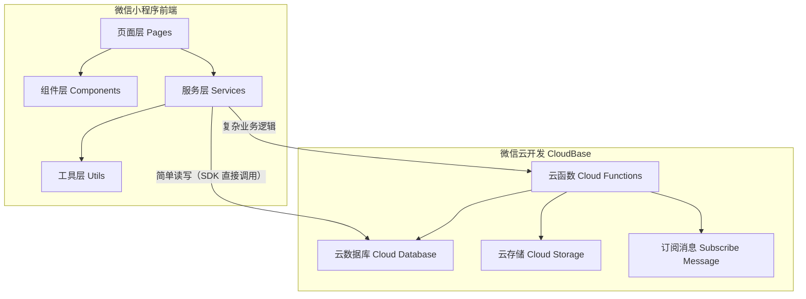

# 设计文档

## 概述

本设计文档描述美甲美睫店铺会员系统微信小程序的技术架构和实现方案。系统采用微信小程序原生开发框架，后端使用微信云开发（CloudBase），实现会员管理、预约服务、消费记录等核心功能。

> 📌 **项目范围说明**：当前项目为用户端（C端），管理端（B端）功能将在独立项目中实现。云函数作为共享后端服务，同时支持两端调用。

## 架构

系统采用微信小程序 + CloudBase 云开发架构，遵循"优先 SDK 直接调用"原则：



### 调用策略

| 场景 | 调用方式 | 说明 |
|------|---------|------|
| 查询服务列表、技师列表 | SDK 直接调用 `wx.cloud.database()` | 简单只读查询，无需云函数 |
| 会员注册、创建预约 | 云函数 `wx.cloud.callFunction()` | 涉及复杂业务逻辑和权限校验 |
| 查询个人预约记录 | SDK 直接调用（数据库权限控制） | 用户只能读自己的数据 |
| 完成服务、积分计算 | 云函数 | 需要原子操作和多集合联动 |
| 发送订阅消息 | 云函数 | 需要服务端权限 |

### 技术栈

- **前端框架**: 微信小程序原生框架（WXML + WXSS + TypeScript）
- **后端服务**: 微信云开发 CloudBase（`cloud1-1g7yz5w766dd366f`）
- **数据库**: 云数据库（MongoDB-like NoSQL）
- **云函数 SDK**: `wx-server-sdk`（CommonJS，云函数 runtime: `Nodejs18`）
- **前端类型**: `miniprogram-api-typings`
- **存储**: 云存储（服务项目图片等静态资源）
- **消息推送**: 微信订阅消息（Subscribe Message）
- **测试框架**: Vitest + fast-check（属性测试）
- **部署工具**: `deploy-advanced.js`（并行部署 + 自动同步 runtime）

### 认证机制

微信小程序 + CloudBase 天然免登录，无需实现登录页面或 OAuth 流程：

```typescript
// app.ts - 初始化云开发环境（一次性）
wx.cloud.init({
  env: 'cloud1-1g7yz5w766dd366f',
  traceUser: true
});

// 云函数中获取用户身份（自动注入，无需验证）
const { OPENID, UNIONID } = cloud.getWXContext();
// OPENID 是用户在本小程序的唯一标识，由微信平台验证，可直接信任
```

**身份识别规则**：
- 用户身份通过 `OPENID` 唯一标识，存储在 `members.openId` 字段
- 云函数中通过 `cloud.getWXContext().OPENID` 获取，无需前端传递
- 数据库权限规则基于 `openId` 实现用户数据隔离

## 组件与接口

> 📌 **项目范围说明**：当前项目为用户端（C端），标注为 `[管理端]` 的接口和页面将在独立的管理端项目中实现。云函数作为共享后端服务，同时支持两端调用。

### 前端页面结构

```
pages/                              # [用户端] 当前项目
├── index/                          # 首页
├── member/
│   ├── register/                   # 会员注册
│   ├── profile/                    # 个人中心
│   └── card/                       # 会员卡
├── service/
│   ├── list/                       # 服务列表
│   └── detail/                     # 服务详情
├── appointment/
│   ├── create/                     # 创建预约
│   ├── list/                       # 预约列表
│   └── detail/                     # 预约详情
├── record/
│   ├── consumption/                # 消费记录
│   └── points/                     # 积分明细
│
└── admin/                          # [管理端] 移至管理端项目
    ├── service/                    # 服务管理
    ├── technician/                 # 技师管理
    └── appointment/                # 预约管理
```

### 服务层调用模式

```typescript
// services/ 目录下的服务层封装两种调用方式

// 1. SDK 直接调用（简单查询，无需云函数）
const db = wx.cloud.database();
const services = await db.collection('services')
  .where({ active: true })
  .orderBy('category', 'asc')
  .get();

// 2. 云函数调用（复杂业务逻辑）
const result = await wx.cloud.callFunction({
  name: 'createAppointment',
  data: { memberId, serviceId, appointmentDate, startTime }
});
```

### 云函数接口

```typescript
// ===== 用户端云函数接口 =====

// 会员相关（需要云函数：涉及唯一编号生成、重复检查等复杂逻辑）
registerMember(userInfo: WxUserInfo, phone: string): Promise<Member>
getMemberProfile(memberId: string): Promise<Member>
updateMemberProfile(memberId: string, data: Partial<Member>): Promise<Member>

// 预约相关（需要云函数：时间冲突检测、技师自动分配、原子操作）
getAvailableSlots(serviceId: string, technicianId?: string, date: string): Promise<TimeSlot[]>
createAppointment(data: CreateAppointmentDTO): Promise<Appointment>
getAppointments(memberId: string, status?: AppointmentStatus): Promise<Appointment[]>
updateAppointment(appointmentId: string, data: UpdateAppointmentDTO): Promise<Appointment>
cancelAppointment(appointmentId: string): Promise<void>

// 管理端云函数接口（供管理端项目调用，当前项目已实现）
getAdminAppointments(options: AdminQueryOptions): Promise<Appointment[]>
confirmArrival(appointmentId: string): Promise<void>
completeService(appointmentId: string, actualAmount: number): Promise<void>
createService(data: CreateServiceDTO): Promise<ServiceItem>
updateService(serviceId: string, data: UpdateServiceDTO): Promise<ServiceItem>
updateTechnicianSchedule(technicianId: string, schedule: Schedule): Promise<void>
updateTechnicianStatus(technicianId: string, status: TechnicianStatus): Promise<void>
```

### 数据库直接访问（SDK 调用）

```typescript
// 以下操作通过 wx.cloud.database() 直接访问，无需云函数
const db = wx.cloud.database();

// 服务列表查询（公开只读）
db.collection('services').where({ active: true }).get()

// 技师列表查询（公开只读）
db.collection('technicians').where({ status: db.command.neq('rest') }).get()

// 消费记录查询（数据库权限：仅读自己的数据）
db.collection('consumption_records').where({ memberId: currentMemberId }).get()

// 积分记录查询（数据库权限：仅读自己的数据）
db.collection('points_records').where({ memberId: currentMemberId }).get()
```

### 工具层模块结构

纯函数工具层位于 `miniprogram/utils/`，按领域拆分：

| 模块 | 文件 | 职责 |
|------|------|------|
| 会员工具 | `utils/member.ts` | 会员编号生成/解析、初始状态、二维码数据、渲染数据 |
| 积分工具 | `utils/points.ts` | 积分计算（`calculateEarnedPoints`）、积分增减、消费积分处理 |
| 预约工具 | `utils/appointment.ts` | 时间冲突检测、技师自动分配、取消/修改逻辑、状态机转换、渲染数据 |
| 服务工具 | `utils/service.ts` | 服务项目渲染、分类过滤 |
| 验证工具 | `utils/validation.ts` | 手机号/昵称/价格/时长/日期/时间格式验证，会员/服务/预约创建校验 |
| 日期工具 | `utils/date.ts` | 日期格式化、时间解析、时间段重叠检测、时间槽生成 |
| 序列化工具 | `utils/serialization.ts` | Member/ServiceItem/Appointment 的 JSON 序列化与反序列化 |

所有工具函数通过 `utils/index.ts` 统一导出。

## 数据模型

### 数据库集合清单

| 集合名 | 说明 | 权限规则 |
|--------|------|---------|
| `members` | 会员信息 | 仅本人读写 |
| `services` | 服务项目 | 所有人可读，管理员可写 |
| `technicians` | 技师信息 | 所有人可读，管理员可写 |
| `appointments` | 预约记录 | 仅本人读写（管理端通过云函数操作） |
| `consumption_records` | 消费记录 | 仅本人可读 |
| `points_records` | 积分记录 | 仅本人可读 |
| `admins` | 管理员列表 | 仅管理员可读 |

### 会员 (Member)

```typescript
interface Member {
  _id: string;                    // 云数据库自动生成 ID
  memberId: string;               // 会员编号 (如: M202312001)
  openId: string;                 // 微信 OPENID（由云函数 getWXContext 获取）
  unionId?: string;               // 微信 UNIONID（可选）
  nickName: string;               // 昵称（2-20字符）
  avatarUrl: string;              // 头像 URL
  phone: string;                  // 手机号（1[3-9]\d{9}）
  level: MemberLevel;             // 会员等级
  points: number;                 // 当前积分（>=0）
  totalConsumption: number;       // 累计消费金额（>=0）
  createdAt: Date;
  updatedAt: Date;
}

enum MemberLevel {
  NORMAL = 'normal',              // 普通会员（消费 < 1000）
  SILVER = 'silver',              // 银卡会员（消费 1000-4999）
  GOLD = 'gold',                  // 金卡会员（消费 5000-9999）
  DIAMOND = 'diamond'             // 钻石会员（消费 >= 10000）
}
```

### 服务项目 (ServiceItem)

```typescript
interface ServiceItem {
  _id: string;
  name: string;                   // 服务名称
  category: ServiceCategory;      // 服务分类
  price: number;                  // 价格（>0）
  duration: number;               // 时长（分钟，>0）
  description: string;            // 描述
  images: string[];               // 示例图片（云存储 fileID）
  active: boolean;                // 是否上架
  createdAt: Date;
  updatedAt: Date;
}

enum ServiceCategory {
  NAIL_ART = 'nail_art',          // 美甲
  EYELASH = 'eyelash',            // 美睫
  NAIL_CARE = 'nail_care',        // 指甲护理
  COMBO = 'combo'                 // 套餐
}
```

### 技师 (Technician)

```typescript
interface Technician {
  _id: string;
  name: string;
  avatarUrl: string;
  specialties: ServiceCategory[];
  status: TechnicianStatus;
  schedule: Schedule;             // 排班表（0=周日，6=周六）
  createdAt: Date;
  updatedAt: Date;
}

enum TechnicianStatus {
  AVAILABLE = 'available',
  BUSY = 'busy',
  REST = 'rest'
}

interface Schedule {
  [dayOfWeek: number]: {
    startTime: string;            // "09:00"
    endTime: string;              // "18:00"
    breaks: Array<{ start: string; end: string }>;
  };
}
```

### 预约 (Appointment)

```typescript
interface Appointment {
  _id: string;
  appointmentId: string;          // 预约编号（如: APT20240115001）
  memberId: string;               // 关联 members._id
  serviceId: string;              // 关联 services._id
  serviceName: string;            // 冗余存储，避免服务修改影响历史记录
  technicianId: string;           // 关联 technicians._id
  technicianName: string;         // 冗余存储
  appointmentDate: string;        // "2024-01-15"
  startTime: string;              // "14:00"
  endTime: string;                // "15:30"（由服务时长自动计算）
  status: AppointmentStatus;
  price: number;                  // 预约时价格（冗余存储）
  actualAmount?: number;          // 实际支付金额
  pointsEarned?: number;          // 获得积分
  remark?: string;                // 用户备注（0-200字）
  peopleCount: number;            // 预约人数（默认1）
  reminderSent: boolean;          // 是否已发送提醒
  createdAt: Date;
  updatedAt: Date;
}

enum AppointmentStatus {
  PENDING = 'pending',            // 待服务
  IN_SERVICE = 'in_service',      // 服务中
  COMPLETED = 'completed',        // 已完成
  CANCELLED = 'cancelled'         // 已取消
}
```

### 消费记录 (ConsumptionRecord)

```typescript
interface ConsumptionRecord {
  _id: string;
  memberId: string;
  appointmentId: string;
  serviceName: string;
  amount: number;
  pointsEarned: number;
  createdAt: Date;
}
```

### 积分记录 (PointsRecord)

```typescript
interface PointsRecord {
  _id: string;
  memberId: string;
  type: PointsType;
  amount: number;                 // 正数获得，负数使用
  balance: number;                // 变动后余额
  description: string;
  relatedId?: string;
  createdAt: Date;
}

enum PointsType {
  EARN = 'earn',                  // 消费获得
  USE = 'use',                    // 使用积分
  BONUS = 'bonus',                // 活动奖励
  EXPIRE = 'expire'               // 过期
}
```

### 扩展数据模型

```typescript
// 会员扩展字段（来源归因和生日）
interface MemberExtended extends Member {
  birthday?: string;              // 生日 (YYYY-MM-DD)
  sourceChannel?: 'platform' | 'wechat' | 'referral';
  referrerMemberId?: string;
  salesStaffId?: string;
  shopId?: string;
}

// 卡项产品
interface CardProduct {
  _id: string;
  name: string;
  type: 'times' | 'stored_value' | 'period';
  faceValue?: number;             // 面值（储值卡）
  totalTimes?: number;            // 总次数（次卡）
  validDays: number;
  price: number;
  description: string;
  active: boolean;
  createdAt: Date;
  updatedAt: Date;
}

// 会员卡实例
interface MemberCard {
  _id: string;
  memberId: string;
  productId: string;
  status: 'active' | 'expired' | 'used_up';
  balance?: number;               // 余额（储值卡）
  remainingTimes?: number;        // 剩余次数（次卡）
  startAt: Date;
  endAt: Date;
  createdAt: Date;
  updatedAt: Date;
}

// 积分商品
interface PointsProduct {
  _id: string;
  name: string;
  pointsCost: number;
  stock: number;
  images: string[];
  description: string;
  active: boolean;
  createdAt: Date;
  updatedAt: Date;
}

// 积分兑换订单
interface PointsOrder {
  _id: string;
  memberId: string;
  productId: string;
  quantity: number;
  pointsCost: number;
  status: 'created' | 'fulfilled' | 'cancelled';
  createdAt: Date;
  updatedAt: Date;
}

// 员工（管理端）
interface Staff {
  _id: string;
  name: string;
  phone: string;
  role: 'technician' | 'sales' | 'admin';
  status: 'active' | 'inactive';
  createdAt: Date;
  updatedAt: Date;
}
```

## 正确性属性

*属性是系统在所有有效执行中应保持为真的特征或行为——本质上是关于系统应该做什么的形式化陈述。属性作为人类可读规范和机器可验证正确性保证之间的桥梁。*

### Property 1: 新会员初始等级正确性

*对于任意*完成注册的用户信息，创建的会员账户等级应为普通会员(NORMAL)，积分应为0，累计消费应为0。

**Validates: Requirements 1.2**

### Property 2: 会员编号唯一性

*对于任意*数量的会员注册操作，所有生成的会员编号应该互不相同。

**Validates: Requirements 1.4**

### Property 3: 会员信息渲染完整性

*对于任意*有效的会员数据，渲染个人中心和会员卡时应包含所有必要字段（头像、昵称、等级、积分、会员编号、二维码数据）。

**Validates: Requirements 2.1, 2.4**

### Property 4: 会员信息验证正确性

*对于任意*会员信息更新请求，验证函数应正确识别有效数据（符合格式要求）和无效数据（不符合格式要求）。

**Validates: Requirements 2.3**

### Property 5: 服务信息渲染完整性

*对于任意*有效的服务项目数据，渲染服务列表和详情时应包含所有必要字段（名称、价格、时长、图片、描述、可选技师、可预约时段）。

**Validates: Requirements 3.1, 3.2**

### Property 6: 预约创建正确性

*对于任意*有效的预约请求（有效会员、有效服务、有效技师、可用时段），系统应成功创建预约记录，且记录包含所有必要信息。

**Validates: Requirements 3.3**

### Property 7: 预约时间冲突检测

*对于任意*已存在预约的时间段，当新预约请求该时段时，系统应拒绝并返回冲突提示。

**Validates: Requirements 3.4**

### Property 8: 技师自动分配正确性

*对于任意*未指定技师的预约请求，系统分配的技师在该时段应确实处于空闲状态。

**Validates: Requirements 3.5**

### Property 9: 预约信息渲染完整性

*对于任意*有效的预约数据，渲染预约列表和详情时应包含所有必要字段（服务项目、技师、时间、状态、店铺地址），且按状态正确分类。

**Validates: Requirements 4.1, 4.2**

### Property 10: 预约取消规则正确性

*对于任意*预约取消请求，系统应根据距离预约时间是否超过24小时执行不同逻辑：超过24小时直接取消并释放时段，24小时内需要确认。

**Validates: Requirements 4.3, 4.4**

### Property 11: 预约修改时段可用性

*对于任意*预约时间修改请求，系统应检查新时段可用性，仅当新时段可用时才更新预约。

**Validates: Requirements 4.5**

### Property 12: 记录信息渲染完整性

*对于任意*有效的消费记录和积分记录数据，渲染时应包含所有必要字段（日期、项目、金额、积分、类型、余额变化）。

**Validates: Requirements 5.1, 5.2**

### Property 13: 积分计算正确性

*对于任意*消费金额，系统计算的积分应符合积分规则（每消费1元获得1积分），且正确累加到会员账户。

**Validates: Requirements 5.3**

### Property 14: 会员等级升级正确性

*对于任意*累计消费金额，系统应根据等级阈值正确计算会员等级（普通<1000, 银卡1000-4999, 金卡5000-9999, 钻石>=10000）。

**Validates: Requirements 5.4**

### Property 15: 服务项目验证正确性

*对于任意*服务项目创建/更新请求，验证函数应正确识别有效数据（包含必填字段且格式正确）和无效数据。

**Validates: Requirements 6.2, 6.3**

### Property 16: 服务下架预约保护

*对于任意*服务下架操作，该服务的已有预约状态应保持不变，仅新预约不可选择该服务。

**Validates: Requirements 6.4**

### Property 17: 技师排班与可预约时段一致性

*对于任意*技师排班设置，该技师的可预约时间段应与排班表完全一致。

**Validates: Requirements 7.2**

### Property 18: 技师状态与可选列表一致性

*对于任意*技师状态变更，当状态为休息时，该技师不应出现在可选技师列表中。

**Validates: Requirements 7.3**

### Property 19: 预约状态机正确性

*对于任意*预约状态转换操作，状态应按照正确的流程转换（待服务→服务中→已完成，或待服务→已取消），且完成服务时应正确触发积分计算。

**Validates: Requirements 8.2, 8.3**

### Property 20: 数据序列化往返一致性

*对于任意*有效的会员/预约/服务数据对象，序列化为JSON后再反序列化应得到与原始数据完全相等的对象。

**Validates: Requirements 9.3**

## 错误处理

### 统一响应格式

所有云函数返回统一格式：

```typescript
// 成功响应
{ success: true, data: T }

// 失败响应
{ success: false, error: { code: string, message: string } }
```

### 错误码定义

```typescript
enum ErrorCode {
  // 通用
  VALIDATION_ERROR = 'VALIDATION_ERROR',
  INTERNAL_ERROR = 'INTERNAL_ERROR',

  // 会员
  MEMBER_NOT_FOUND = 'MEMBER_NOT_FOUND',
  MEMBER_ALREADY_EXISTS = 'MEMBER_ALREADY_EXISTS',
  PHONE_ALREADY_BOUND = 'PHONE_ALREADY_BOUND',

  // 预约
  TIME_SLOT_UNAVAILABLE = 'TIME_SLOT_UNAVAILABLE',
  APPOINTMENT_NOT_FOUND = 'APPOINTMENT_NOT_FOUND',
  CANCEL_NOT_ALLOWED = 'CANCEL_NOT_ALLOWED',

  // 服务/技师
  SERVICE_NOT_FOUND = 'SERVICE_NOT_FOUND',
  SERVICE_UNAVAILABLE = 'SERVICE_UNAVAILABLE',
  TECHNICIAN_NOT_FOUND = 'TECHNICIAN_NOT_FOUND',
  TECHNICIAN_UNAVAILABLE = 'TECHNICIAN_UNAVAILABLE',
}
```

### 前端错误处理原则

- 网络错误：提示"网络异常，请稍后重试"
- 业务错误：展示 `error.message` 字段内容
- 不暴露技术细节（堆栈、内部错误码）
- 所有云函数调用使用 try-catch 包装

## 测试策略

### 单元测试（Vitest）

覆盖纯函数逻辑，文件位于 `tests/unit/`：

- 数据验证函数（手机号、昵称、时间格式）
- 积分计算逻辑
- 会员等级计算
- 时间段冲突检测
- 数据序列化/反序列化
- 云函数逻辑（通过 `vi.doMock` mock `wx-server-sdk`）

### 属性测试（fast-check）

文件位于 `tests/property/`，每个属性测试运行至少100次迭代。

每个属性测试使用以下格式标注：

```typescript
// **Feature: nail-salon-membership, Property {number}: {property_text}**
```

覆盖的属性（对应上方 Property 1-20）：
- 会员注册初始状态（Property 1, 2）
- 会员信息验证与渲染（Property 3, 4）
- 服务信息渲染（Property 5）
- 预约创建、冲突检测、技师分配（Property 6, 7, 8）
- 预约信息渲染、取消规则、修改（Property 9, 10, 11）
- 记录渲染、积分计算、等级升级（Property 12, 13, 14）
- 服务验证、下架保护（Property 15, 16）
- 技师排班与状态（Property 17, 18）
- 预约状态机（Property 19）
- 数据序列化往返一致性（Property 20）

### 测试文件结构

```
tests/
├── unit/
│   ├── validation.test.ts
│   ├── date.test.ts
│   └── ...
├── property/
│   ├── member.property.test.ts
│   ├── appointment.property.test.ts
│   ├── service.property.test.ts
│   ├── points.property.test.ts
│   ├── technician.property.test.ts
│   └── serialization.property.test.ts
└── setup.ts                        # Jest 全局 mock（wx、cloud）
```

### 运行测试

```bash
npm test                  # 运行所有测试
npm run test:coverage     # 带覆盖率报告
```

## 部署

### 云函数部署

部署由 `cloudbaserc.json` 驱动，使用 `deploy-advanced.js` 批量部署：

```bash
node deploy-advanced.js
```

脚本行为：
1. 递归扫描 `cloudfunctions/`，识别含 `package.json` + `index.js` 的目录为可部署函数
2. 部署前通过 `tcb fn detail` 读取云端已有函数的 `runtime`，写回 `cloudbaserc.json`，避免 "Runtime 不支持修改" 错误
3. 并行部署所有函数，失败自动重试
4. 输出部署报告到 `.cloudbase-deploy/reports/`

### 云函数规范

每个云函数目录结构：

```
cloudfunctions/
└── functionName/
    ├── index.js          # 入口文件（CommonJS）
    └── package.json      # 依赖声明（含 wx-server-sdk）
```

云函数初始化模板：

```javascript
const cloud = require('wx-server-sdk');
cloud.init({ env: cloud.DYNAMIC_CURRENT_ENV });

exports.main = async (event, context) => {
  const { OPENID } = cloud.getWXContext();
  try {
    // 业务逻辑
    return { success: true, data: result };
  } catch (error) {
    console.error('函数名执行失败:', error);
    return { success: false, error: { code: 'INTERNAL_ERROR', message: '操作失败，请稍后重试' } };
  }
};
```

### 环境配置

```json
// cloudbaserc.json（关键字段）
{
  "envId": "cloud1-1g7yz5w766dd366f",
  "functionRoot": "cloudfunctions",
  "functions": [
    { "name": "registerMember", "runtime": "Nodejs18" },
    { "name": "createAppointment", "runtime": "Nodejs18" }
  ]
}
```

> ⚠️ `runtime` 字段在函数创建后不可修改，`deploy-advanced.js` 会自动从云端读取并同步，无需手动维护。
